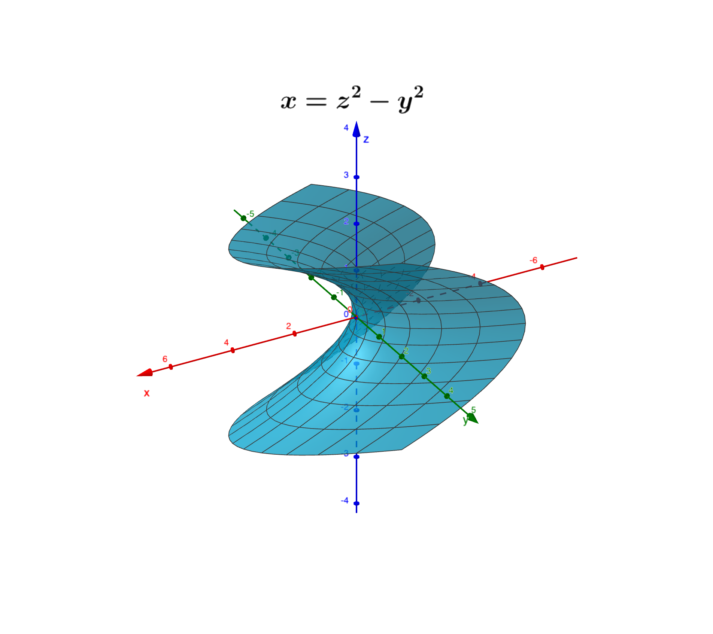

# This is a collection of figures in Cartesian Geometry

## Surface of cylinder $x^2 + y^2 = a^2$

## Surface of cylinder $y^2 + z^2 = a^2$

## Surface of cylinder $x^2 + z^2 = a^2$

## Surface of cylinder $\frac{x^2}{a^2}+\frac{y^2}{b^2}+\frac{z^2}{c^2}=1,a=\max(a,b,c)$

## Surface of cylinder $\frac{x^2}{a^2}+\frac{y^2}{b^2}+\frac{z^2}{c^2}=1,b=\max(a,b,c)$

## Surface of cylinder $\frac{x^2}{a^2}+\frac{y^2}{b^2}+\frac{z^2}{c^2}=1,c=\max(a,b,c)$

## Surface of hyperboloid of single sheet $-\frac{x^2}{a^2}+\frac{y^2}{b^2}+\frac{z^2}{c^2}=1$

## Surface of hyperboloid of single sheet $\frac{x^2}{a^2}-\frac{y^2}{b^2}+\frac{z^2}{c^2}=1$

## Surface of hyperboloid of two sheets $\frac{x^2}{a^2}+\frac{y^2}{b^2}-\frac{z^2}{c^2}=-1$

## Surface of paraboloid $x=-(y^2+z^2)$

## Surface of paraboloid $z=-(x^2+y^2)$

## Surface of hyperbolic paraboloid $z=x^2-y^2$

## Surface of hyperbolic paraboloid $x=z^2-y^2$

## Surface of hyperbolic paraboloid $x=y^2-z^2$

## Surfaces of $z = \sqrt{x^2+y^2}$ and $z^2 = x$

The upper surface is $z^2 = x$, and the lower surface 
is $z = \sqrt{x^2 + y^2}$. The projection of the volume
on xy plane is $(x-1)^2 + y^2 \le 1$.

